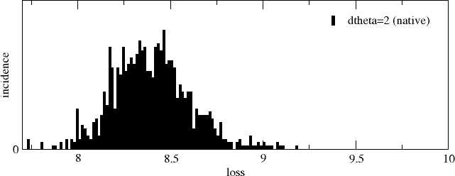

## What it is all about

### Main idea
Typical problem while applying the <a href="https://en.wikipedia.org/wiki/Autoencoder">autoencoders</a>  (AE) is connected with the fact that we are looking not just for all possible outliers which our AE can deliver, but only for some *specific ones* defined according to some particular criteria, e.g. set by a customer. Let's call such outliers "defects". E.g., by applying an AE within the production line which produces defects rarely it can happen that the other types of outliers will be estimated by an AE even stronger than the defects:

<p align="center"> 

Without applying some specific metrics your AE won't be able to distinguish them from the rest of the outliers. In this case it appears very helpful to make use of some prior knowledge about this specific type of outliers, if available. In real life a handful of the defect representatives can be always collected. The basic idea then is to tell the AE, what type of elements it *should not learn*. In the context of the model fitting it can be realized by introducing an extra penalty loss for such elements, which is called <a href="https://arxiv.org/abs/2007.11457">"contrastive" loss</a>  . Then the total loss becomes the sum of the "recovery" and "contrastive" contributions (squared difference loss here is just a particular case):

$${\rm loss} = \sum_{i}\left(x_{i} - {\rm model}(x_{i})\right)^2 - \sum_{i,d}\left({\rm model}(x_{i})- {\rm model}(x_{d})\right)^2 + \sum_{i>j}\left({\rm model}(x_{i})-{\rm model}(x_{j})\right)^2,$$
where the "traditional" recovery loss is represented by the first term and the last two terms represent the "contrastive" contribution. Whereas the second (negative) term maximizes the distance between the main group ($x_{i}$) and the defect ($x_{d}$) clouds, the third (positive) term tries to compact the main group points together,  mainly serving as a supplemental for the second one. Both contrastive loss contributios are shown below schematically as a sum of the black and the red connectors. The arrow indicates what kind of data transformation (i.e., separation of defects) is assumed to achieve by adding contrastive loss to the fitting:

<p align="center"> 

It is important to stress, that the contrastive loss is not a real loss in the sense of the AE paradigm, i.e., it does not care about the input recovery as the very first term ("traditional") in the total loss expression above does. Contrastive loss is  a penalty which only makes the defects to be as distinct as possible from the main-group elements. The defects get badly recovered simply because they are forced to be distinct to a well-recovered main group.

### Latent space
If to implement contrastive loss literally as it is shown above, its backpropagation through the whole model will affect both decoder and encoder directly and might strongly spoil the converency of the recovery term. For this reason it is adviced to compute contrastive part of the loss within the latent space. Reorganizing the latent space should not dramatically affect the encoder/decoder functions connecting it with the "real" space. Taking this into account the previous expression turns to
<a name="loss">

$${\rm loss} = \sum_{i}\left(x_{i} - {\rm model}(x_{i})\right)^2 - \sum_{i,d}\left({\rm enc}(x_{i})- {\rm enc}(x_{d})\right)^2 + \sum_{i>j}\left({\rm enc}(x_{i})-{\rm enc}(x_{j})\right)^2,$$

</a>

where $\rm enc$ - is the encoder component of the model. The whole model is the combination of both, encoder and decoder: ${\rm model}(x) = {\rm dec}({\rm enc}(x)).$


## Current repo with example

To demonstrate the advantage of the contrastive loss account on a particular example, as a  <a href="model_convlstm_ae.py">model</a> we take a version of the so-called <a href="https://link.springer.com/article/10.1007/s10489-022-03613-1">Spatio-Temporal AE</a> translated into Pytorch. The model is intended to binary classify the video fragments, i.e. as "normal/anomal". Training and testing procedures are configured in `config.json`:

```
{
    "n_channels": 1,
    "path_save_model": "model_sav",
    "path_scratch": "scratch",
    "batch_size_train": 100,
    "batch_size_val": 8,
    "seqlen": 21,
    "height": 101,
    "width": 101,
    "learning_rate": 0.0005,
    "epochs": 20000,
    "loss_type": "mse",
    "dtheta": 2.0,
    "contrastive_loss":{
	"n_outliers": 8,
	"n_outliers_val":2,
	"dtheta": 2.1
    },
    "inference": {
	"results": "res_dtheta=1.9",
	"weights": "model_sav/best.pth",
	"loss_type": "mse",
	"n_samples": 1000,
	"random_seq": "False"
    }
}

```


As input the  model takes a fixed-length sequence of frames,  defined in `config.json` as `"seq_len":21`. The sequences are produced by replicating the same "coin" image `img.png` rotated clockwise by, say, 2-degrees step from frame to frame:
<p align="center"> </p>

In `config.json` the corresponding entry is `"d_theta":2.0`. Since the starting angle is arbitrary, we can generate infinite number of such sequences. For this reason, one epoch will consist of a single batch. The batch size is given by `"batch_size_train": 100` sequences. Each frame is brought to the fixed "height" $\times$ "width" format as defined in `config.json`: `"height": 101`, `"width": 101`; `"n_channels": 1` takes care of the grayscale.

### "Conventional" training
By starting from scratch, we first switch of contrastive loss completely, by setting
```
    "contrastive_loss":{
	"n_outliers": 0,
	"n_outliers_val": 0,
	...
    }		
```
and run conventional AE training untill the accepted convergecy. All relevant training parameters like number of epochs, learning rate and the training and validation batch sized  you will find in `config.json`.  To start the training all you need is:

`python3 main_train.py`

After each 10 epochs the script writes the validation images into `scratch` folder (defined in `config.json` as `"path_scratch": "scratch"`). Below are shown the validation batches (8 odd columns correspond to the input, 8 even - to the recovered sequences), after 0, 100, 200 and 2000 training epochs, respectively:

<p align="center">
  
  
  
  
</p>

The image filenames also include the corresponding loss values: 720.331 (epoch=0), ... , 118.862 (epoch=2000). The model weights will be saved in the folder specified in the `config.json`: `"path_save_model": "model_sav"` into `model_sav/best.pth` (the best  validation state achieved so far). The evolution of loss in this example looks approximately as: 
<p align="center">
  
</p>
As it follows from the plot, the train loss almost coinsides with the validation loss. The first plateu corresponds to the recovery of the numbers "78" and the second - to the recovery of the margin of a coin.

The train output looks as following:


```
epoch          0  loss_t  734.32562  loss_v  720.33147  loss_min  9999.00000
epoch          1  loss_t  720.38177  loss_v  707.68294  loss_min  9999.00000
epoch          2  loss_t  708.11975  loss_v  715.80850  loss_min  9999.00000
epoch          3  loss_t  716.32477  loss_v  703.56097  loss_min  9999.00000
epoch          4  loss_t  703.72540  loss_v  702.49293  loss_min  9999.00000
epoch          5  loss_t  702.78949  loss_v  700.72666  loss_min  9999.00000
epoch          6  loss_t  700.92908  loss_v  697.10589  loss_min  9999.00000
epoch          7  loss_t  696.99084  loss_v  690.58743  loss_min  9999.00000
epoch          8  loss_t  690.54858  loss_v  687.38532  loss_min  9999.00000
epoch          9  loss_t  686.83411  loss_v  682.44596  loss_min  9999.00000
epoch         10  loss_t  682.11365  loss_v  675.76274  loss_min  9999.00000
epoch         11  loss_t  675.48157  loss_v  674.57050  loss_min  674.57050
epoch         12  loss_t  673.97961  loss_v  672.83231  loss_min  672.83231
epoch         13  loss_t  672.78430  loss_v  672.57436  loss_min  672.57436
...
epoch       2110  loss_t  26.73004  loss_v  26.27424  loss_min  26.19759
epoch       2111  loss_t  26.46295  loss_v  24.98747  loss_min  24.98747
```
where `loss_t`, `loss_v` - are the train and validation losses; `loss_min` - minimal validation loss achieved so far.


### Validation and analysis
Once the training is finished let us a bit explore the results. For testing all you need is to run 

`python3 main_inf.py`

First lets check the main group. For this we keep `"dtheta": 2.0` and change name the output folder to `res_native` (all folder names are fully arbitrary):

```
"dtheta": 2.0,
...
"inference": {
	"results": "res_native",
```
The script will write 1000 of validation images into it in a format `<index>_<loss>.png`, as well as a histogram of the collected losses (as two-column ASCII table of x- and y- values) - `histogram.dat`.
The choice how to plot y(x) data, I would leave to you. Here it looks like as: 
<p align="center">
  
</p>

One can repeat the same procedure to create and validate different sorts of outliers.  For example, we can validate the sequences with different rotation rates, by changing `dtheta` angle in `config.json`:
- ```
      "dtheta": 1.0,
      ...
      "inference": {
      "results": "res_dtheta=1.0",
      ...  ```     
or to rotate them in the opposite direction:

- ```
      "dtheta": -2.0,
      ...
      "inference": {
      "results": "res_dtheta=-2.0",
      ... ```
or to generate completely random sequences:

- ```
      ...
      "inference": {
      "results": "res_random",
      "random_seq": "True",
      ...```

You might continue to play around inventing various deviations from the main group, but let's then collect all these histograms in a single plot:

<a name="hist_traditional">
<p align="center">
  
</p>
</a>

As it follows, even extremely small deviations from the main group (the latter is seen as black vertical line very close to the origin), such as `dtheta=2.1` or `dtheta=1.9` (in gray and orange), can be distinguished in the loss histogram by the model.
Indeed, in the range of ${\rm loss}<500$  it is difficult to notice the recovery inaccuracies. Only for ${\rm loss}>550$  they become noticeably pronounced (completely random case). This just indicates that the AE model is sufficiently fit for the selected with 2-degree step rotated main group.

### Contrastive loss

Here starts the most interesting part. Let's suppose that the "defects" your customer is interested in are, say, the `dtheta=2.1` sequences (gray distribution at ${\rm loss}\approx45$)  and nothing else. Actually it's a pretty difficult case. Indeed, there is no way to distinguish them from other outliers situated even  more far along the loss scale. But if your customer could give you few examples of how these defects look like, you might be lucky to push these states far away to distinct them from other outliers with the help of the contrastive loss penalty.

In our example we can simply generate them.  All you need to do is to change in `config.json` the `"contrastive loss"` entry as:
```
    "contrastive_loss":{
	"n_outliers": 8,
	"n_outliers_val": 2,
	"dtheta": 2.1
    },
```

which means that, our train batch will now consist of `batch_size_train` main-group elements (corresponding to `dtheta=2`) + `n_outliers` defect elements (corresponding to `dtheta=2.1`), i.e. 100 + 8 = 108. The main-group elements will be treated as before, i.e. the model will get optimized to get their best recovery, whereas for the last 8 defect elements only contrastive loss will be minimized (of course, in combination with the main-group elements according to the <a href="#loss">loss expression</a>). `"n_outliers_val": 2` is referred to the analogical validation batch extension. As a starting point the weights `model_sav/best.pth` converged in conventional sense will be used. With all this, we start training again:

`python3 main_train.py`

Here is the sample output:

```
...load best train state

epoch       2012  loss_t  22.26292  loss_ct   9.31342  loss_v  22.07575  loss_cv  10.16576  loss_min  32.24151
epoch       2013  loss_t  22.31092  loss_ct   9.38032  loss_v  22.41380  loss_cv  12.06579  loss_min  32.24151
epoch       2014  loss_t  22.35097  loss_ct   9.34304  loss_v  22.14702  loss_cv  10.30746  loss_min  32.24151
epoch       2015  loss_t  22.31703  loss_ct   9.22858  loss_v  21.84071  loss_cv   8.95389  loss_min  30.79460
epoch       2016  loss_t  22.20842  loss_ct   9.14695  loss_v  22.20956  loss_cv  11.60964  loss_min  30.79460
epoch       2017  loss_t  22.16968  loss_ct   9.25171  loss_v  22.53164  loss_cv   8.11276  loss_min  30.64440
epoch       2018  loss_t  22.28966  loss_ct   9.23498  loss_v  21.79909  loss_cv   7.92610  loss_min  29.72519
epoch       2019  loss_t  22.03301  loss_ct   8.90203  loss_v  22.17157  loss_cv   8.83749  loss_min  29.72519
epoch       2020  loss_t  22.30168  loss_ct   8.88872  loss_v  22.69706  loss_cv   8.86271  loss_min  29.72519
epoch       2021  loss_t  22.13942  loss_ct   8.95030  loss_v  21.76519  loss_cv   3.82834  loss_min  25.59352
epoch       2022  loss_t  22.16170  loss_ct   9.09391  loss_v  21.97452  loss_cv  10.40417  loss_min  25.59352
epoch       2023  loss_t  22.17958  loss_ct   8.88447  loss_v  22.33789  loss_cv   8.60914  loss_min  25.59352
epoch       2024  loss_t  22.43778  loss_ct   8.95103  loss_v  22.64667  loss_cv  11.38314  loss_min  25.59352
epoch       2025  loss_t  23.06281  loss_ct   8.92239  loss_v  24.23825  loss_cv   7.21049  loss_min  25.59352
epoch       2026  loss_t  24.45127  loss_ct   8.62613  loss_v  28.32641  loss_cv   0.75315  loss_min  25.59352
epoch       2027  loss_t  27.72786  loss_ct   8.85558  loss_v  34.80695  loss_cv   9.76584  loss_min  25.59352
epoch       2028  loss_t  33.44135  loss_ct   8.82414  loss_v  32.01104  loss_cv  11.52482  loss_min  25.59352
...
```

One may notice additional terms: `loss_ct` - training contrastive loss term, `loss_cv` - validation contrastive loss term. `loss_min` represents the best achieved total validation loss: `loss+v` + `loss_cv`. Contrastive terms will evolve into the negative values with growing amplitude:
    	
```
...
epoch       6479  loss_t  12.24978  loss_ct  -6.66907  loss_v  11.93339  loss_cv  -0.38260  loss_min   8.87670
epoch       6480  loss_t  12.31834  loss_ct  -7.48233  loss_v  12.61111  loss_cv   0.34329  loss_min   8.87670
epoch       6481  loss_t  12.61161  loss_ct  -8.00592  loss_v  11.59470  loss_cv  -1.69325  loss_min   8.87670
epoch       6482  loss_t  12.06480  loss_ct  -7.16837  loss_v  11.98235  loss_cv  -0.84660  loss_min   8.87670
...
epoch      10450  loss_t  10.30223  loss_ct  -47.32193  loss_v   9.71696  loss_cv  -11.27871  loss_min  -3.92846
epoch      10451  loss_t   9.86700  loss_ct  -47.34704  loss_v  10.17814  loss_cv  -10.97610  loss_min  -3.92846
epoch      10452  loss_t  10.21560  loss_ct  -47.31858  loss_v  10.01949  loss_cv  -11.12569  loss_min  -3.92846
epoch      10453  loss_t  10.51998  loss_ct  -47.36170  loss_v  10.16455  loss_cv  -11.14960  loss_min  -3.92846
...
```

The batch images in `scratch` folder will now contain two additional pairs of columns, corresponding to the recovery of the defects, added on top. Here are the sample images after 4240, 6450, 6510 and 9990 training epochs (the 0-th epoch corresponds to a very beginning, ), respectively:

<p align="center">
  
  
  
  
</p>

As it follows, the first 8 pairs of columns show a good recovery in all four examples. Indeed, these are the main-group sequences and the weights were specifically optimized for them in the previous step.

What is really interesting, it is the evolution of the last two pairs of columns representing our defects: by more epochs their recoveries are getting worse. This is the result of inclusion of the contrastive loss terms in the <a href="#loss">total loss expression</a>. These are the $2.1$-degree rotations corresponding to the gray peak in the <a href="#hist_traditional">recovery loss histogram</a>, which we added to the main-group batch of $2.0$-degree rotations. Their recovery loss will now become much higher.


Now let's plot the recovery loss histogram again:

<a name="hist_contrastive">
<p align="center">
  
</p>
</a>


As it turns out, the whole $2.1$-degree peak (gray) is pushed from its original position at $\sim 50$